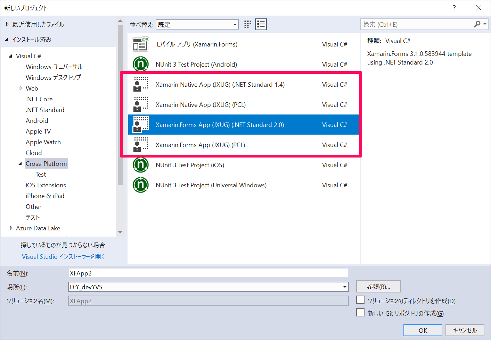

# Xamarin Native Template

This is source code of newest Xamarin Native cross-platform app with .NET Standard 2.0 core project Template made by Japan Xamarin User Group.

## Specification

- MonoAndroid 9.0 and Android Support Library 28.0.0.1
- .NET Standard 2.0 core project
- PackageReference (can use only Visual Studio 2017)

## System Requirement

- Windows 10 (Recommend) or 7
- Visual Studio 2017
- Android SDK 28

# How to get

### Option 1: Clone the Repository (Recommended)

If you have git or some client tools for Github, the easiest way to get it is just clone the project on the following location directly:

`%USERPROFILE%\Documents\Visual Studio 2017\Templates\ProjectTemplates\Visual C#`

or make `Cross-Platform` directory in the above directory, then clone this repogitory.

```
cd "%USERPROFILE%\Documents\Visual Studio 2017\Templates\ProjectTemplates\Visual C#"
git clone https://github.com/ytabuchi/XamarinNativeNetStandardTemplate.git
```

After the first clone, you can update your copy by `git pull` in `XamarinNativeNetStandardTemplate` directory.

### Option 2: Download the ZIP

- Download XamarinFormsTemplate-master.zip file from [GitHub](https://github.com/ytabuchi/XamarinNativeNetStandardTemplate/archive/master.zip)
- Extract the zip file
- Move the extracted `XamarinNativeNetStandardTemplate-master` folder to the following location:
`%USERPROFILE%\Documents\Visual Studio 2017\Templates\ProjectTemplates\Visual C#`

# How to Use

Select templates



In this template, the Bundle ID is set `org.jxug.PROJECTNAME`. If you want to use your own Bundle ID such as `com.yourcompany.PROJECTNAME`, please follow the instructions below:

- Android
    - Oepn `Properties\AndroidManifest.xml`, then change `package="org.jxug.$ext_safeprojectname$"`.
    - `$ext_safeprojectname$` will be replaced with a new project name that you input in "New project" window.
- iOS
    - Open `Info.plist`, then change `<string>org.jxug.$ext_safeprojectname$</string>`.
    - `$ext_safeprojectname$` will be replaced with a new project name that you input in "New project" window.
- UWP
    - UWP package name will be set from UUID, so that you need nothing to do.

### Note

1. If you want to support UWP app with Windows 10 Creators Update(10.0.15063.0) or lower, .NET Standard 2.0 is not supported. Use .NET Standard 1.4.

# How to maintenance

`MyTemplate.vstemplate` located in Root folder is a Master file that is specify each child projects.
In each projects folder, there are `MyTemplate.vstemplate` files. They are the template setting files for each projects.

If Xamarin.Forms will be updated, you can just change the version numbers of each `MyTemplate.vstemplate` files

There are some macros in the template files. Please see [Microsoft document](https://docs.microsoft.com/ja-jp/visualstudio/ide/template-parameters) for each meaning.
