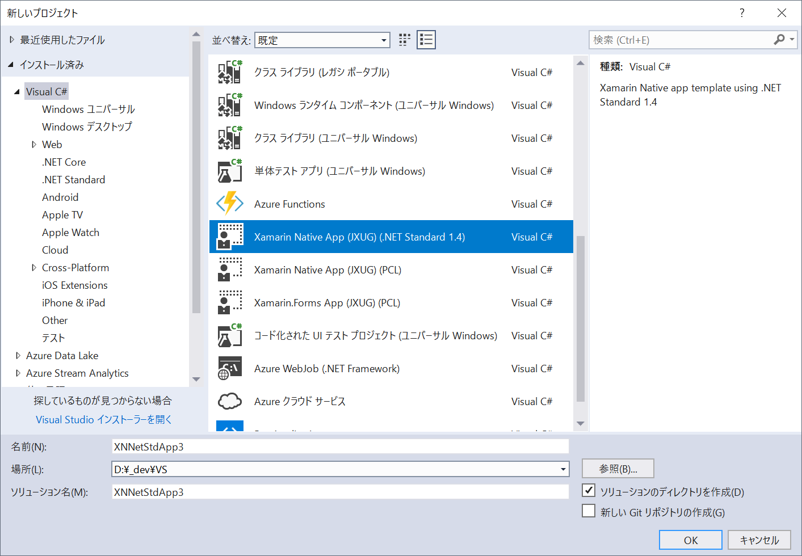

# XamarinFormsTemplate

This is source code of newest Xamarin Native cross-platform app with .NET Standard 1.4 core project Template made by Japan Xamarin User Group.

# How to get

### Option 1: Clone the Repository (Recommended)

Clone the project on the following location directly:

`%USERPROFILE%\Documents\Visual Studio 2017\Templates\ProjectTemplates\Visual C#`

That is, on a command prompt, you can install the template by the following commands:

```
cd "%USERPROFILE%\Documents\Visual Studio 2017\Templates\ProjectTemplates\Visual C#"
git clone https://github.com/ytabuchi/XamarinNativeNetStandardTemplate.git
```

After the first installation, you can of course update your copy by `git pull` and you feel it's easier to update the templates than the other option.

### Option 2: Download the ZIP

- Download XamarinFormsTemplate-master.zip file from [GitHub](https://github.com/ytabuchi/XamarinNativeNetStandardTemplate/archive/master.zip)
- Extract the zip file
- Move the extracted `XamarinNativeNetStandardTemplate-master` folder to the following location:
`%USERPROFILE%\Documents\Visual Studio 2017\Templates\ProjectTemplates\Visual C#`

# How to Use

Select `New Project > Visual C# > "Xamarin Native App (JXUG)(Net Standard 1.4)"` and `OK`



### Notice

1. Cannot create `Class1.cs` in .NET Standard project. Please create cs files. (Sorry, i couldn't fix it.)
1. Cannot remove `NU1603` warning such like below:
    `runtime.native.System.IO.Compression 4.3.0 is depended on runtime.win10-arm64.runtime.native.System.IO.Compression (>= 4.3.0), but  runtime.win10-arm64.runtime.native.System.IO.Compression 4.3.0 is not found.`
    It seems nuget issue, so please ignore this warning.
    Or set Minimum target version to `Fall Creators Update (10.0.16299)` in Properties dialog of UWP project.
1. .NET Standard version of core project is 1.4 because UWP does not support .NET Standard 2.0 except newer than `Fall Creators Update (10.0.16299)`. If you want to use .NET Standard 2.0, please set Minimum target version to `Fall Creators Update (10.0.16299)` in Properties dialog of UWP project.

# How to maintenance

`MyTemplate.vstemplate` located in Root folder is a Master file that is specify each child projects.
In each projects folder, there are `MyTemplate.vstemplate` files. They are the template setting files for each projects.

If Xamarin.Forms will be updated, you can just change the version numbers of each `MyTemplate.vstemplate` files

There are some macros in the template files. Please see [Microsoft document](https://docs.microsoft.com/ja-jp/visualstudio/ide/template-parameters) for each meaning.
